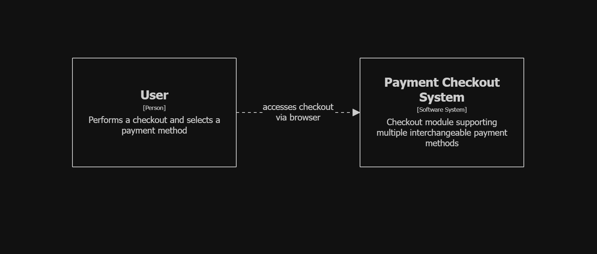
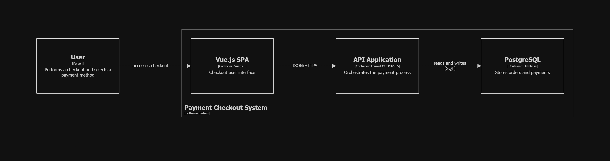
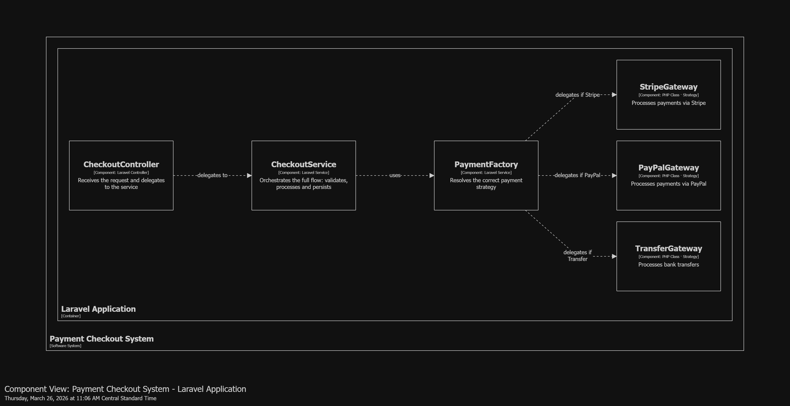
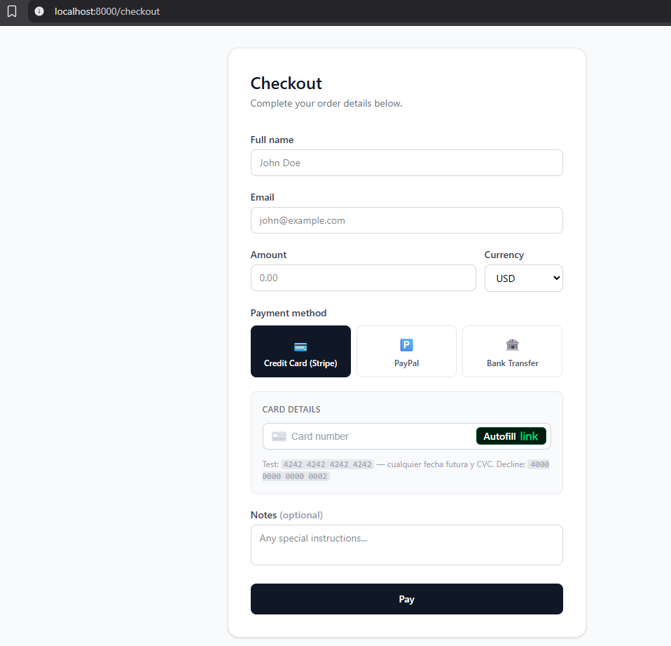
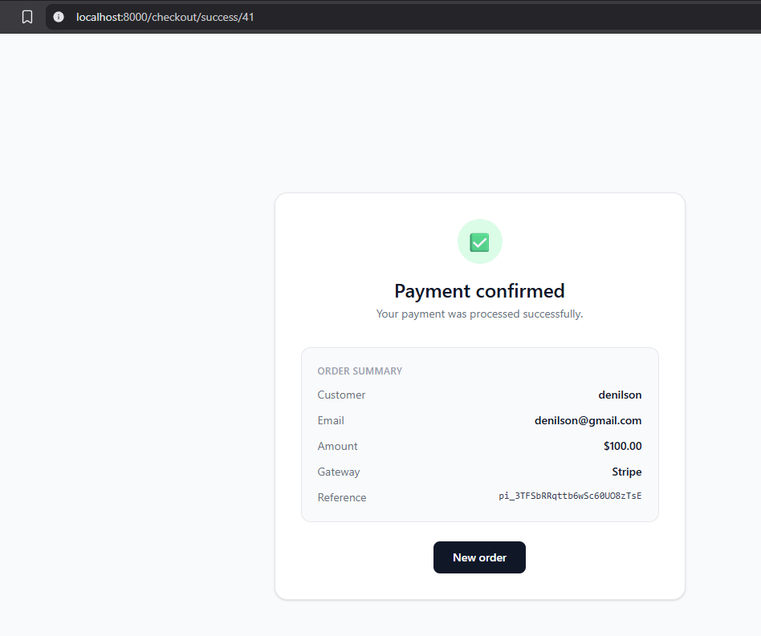
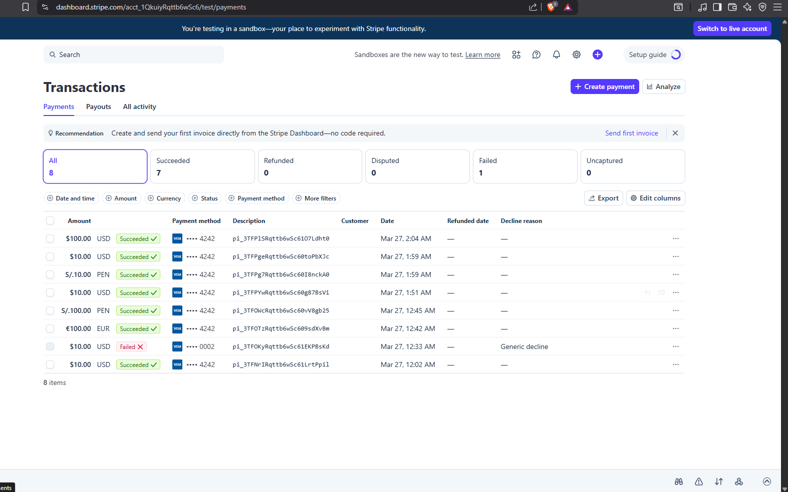

# Checkout Strategy Pattern

A Laravel 13 application demonstrating the **Strategy** and **Factory** design patterns applied to a real-world e-commerce checkout flow. The system supports multiple interchangeable payment gateways (Stripe, PayPal, Bank Transfer) without modifying the core checkout logic.

---

## C4 Model

Before writing a single line of code, the architecture was designed using the **C4 Model** (Context, Containers, Components). The model covers Levels 1–3. Level 4 (Code) was intentionally omitted — the design patterns and project structure sections below serve that purpose.

### Level 1 — System Context

Defines who interacts with the system and what external systems it depends on.



### Level 2 — Container

Shows the high-level technology choices and how responsibilities are distributed across containers.



### Level 3 — Component

Zooms into the application and shows how the Strategy Pattern is structured — the `CheckoutService`, `PaymentFactory`, `PaymentGatewayInterface`, and concrete gateway implementations.



---

## Stack

| Layer          | Technology               |
| -------------- | ------------------------ |
| Backend        | Laravel 13 (PHP 8.5)     |
| Frontend       | Vue 3 + Inertia.js       |
| Styling        | Tailwind CSS v4          |
| Database       | PostgreSQL 16            |
| Payment        | Stripe API + Stripe.js   |
| Testing        | PHPUnit (Unit + Feature) |
| Infrastructure | Docker + Nginx           |

---

## Patterns Applied

### Strategy Pattern

The `PaymentGatewayInterface` defines the contract. Each gateway (`StripeGateway`, `PayPalGateway`, `TransferGateway`) implements it independently. `CheckoutService` delegates to whichever strategy is injected — it never references a concrete class.

```
PaymentGatewayInterface
    ├── StripeGateway       → real Stripe API (PaymentIntent)
    ├── PayPalGateway       → simulated (validates paypal_email)
    └── TransferGateway     → simulated (always pending)
```

**Why Strategy?** The checkout flow is identical for every payment method. Without this pattern, you'd end up with a chain of `if/elseif` blocks in the controller that grows every time a new gateway is added. Strategy isolates each gateway's logic and satisfies the Open/Closed Principle — new gateways require zero changes to existing code.

> **Implementation note:** Of the three gateways, only **Stripe** is integrated with a real API (Stripe PaymentIntent). PayPal and Bank Transfer are simulated implementations that demonstrate the pattern — replacing them with real SDKs would only require changes inside their respective gateway classes, with zero impact on the rest of the system.

### Factory Pattern

`PaymentFactory::make(PaymentMethod $method)` resolves the correct gateway class via the Laravel container (`app($class)`). The caller never instantiates a gateway directly.

**Why Factory?** It centralizes gateway resolution in one place. Using `app($class)` instead of `new $class()` means the Laravel container handles dependency injection and — critically — allows tests to swap the real `StripeGateway` with a mock via `$this->instance(...)` without touching production code.

### Why Inertia.js + Vue 3?

Inertia.js acts as the glue between a traditional Laravel server-side application and a Vue 3 SPA — without needing a separate REST API. The server controls routing and data; Vue handles the UI. This keeps the project simple while delivering a modern single-page experience with no full page reloads.

### Why Stripe.js on the frontend?

Card data is tokenized directly in the browser by Stripe's SDK and never touches the Laravel server. Laravel only receives a `payment_method_id` token, which is then used to confirm a `PaymentIntent` server-side. This approach is PCI-compliant by design.

---

## Architecture

This project follows a **Layered Architecture (N-Tier)**, which is the natural structure of a Laravel application applied with clear separation of concerns. Each layer has a single responsibility and only communicates with the layer directly below it — the Controller never touches Models directly, the Service never knows about HTTP, and so on.

| Layer              | Responsibility                                   | Files                                                                          |
| ------------------ | ------------------------------------------------ | ------------------------------------------------------------------------------ |
| **Presentation**   | UI, forms, user interaction                      | `Checkout.vue`, `CheckoutSuccess.vue`                                          |
| **HTTP**           | Receive request, validate input, return response | `CheckoutController`                                                           |
| **Business Logic** | Orchestrate the checkout flow                    | `CheckoutService`, `PaymentFactory`                                            |
| **Domain**         | Payment gateway contracts and implementations    | `PaymentGatewayInterface`, `StripeGateway`, `PayPalGateway`, `TransferGateway` |
| **Data**           | Persistence                                      | `Order`, `Payment` models + PostgreSQL                                         |

> This is not a complex architecture like Hexagonal or Clean Architecture. The real architectural value of this project lives in the **design patterns applied inside the Business Logic and Domain layers** (Strategy + Factory), not in the layer structure itself.

```
┌─────────────────────────────────────────────┐
│           Presentation Layer                │
│      Vue 3 + Inertia.js + Stripe.js         │
└────────────────────┬────────────────────────┘
                     │ HTTP (Inertia)
┌────────────────────▼────────────────────────┐
│              HTTP Layer                     │
│           CheckoutController                │
└────────────────────┬────────────────────────┘
                     │
┌────────────────────▼────────────────────────┐
│          Business Logic Layer               │
│    CheckoutService → PaymentFactory         │
└────────────────────┬────────────────────────┘
                     │
┌────────────────────▼────────────────────────┐
│              Domain Layer                   │
│  StripeGateway  PayPalGateway  Transfer     │
│         (PaymentGatewayInterface)           │
└────────────────────┬────────────────────────┘
                     │
┌────────────────────▼────────────────────────┐
│               Data Layer                    │
│         Order + Payment (PostgreSQL)        │
└─────────────────────────────────────────────┘
```

**Request flow:**

1. User fills the checkout form, Stripe.js tokenizes the card → `payment_method_id`
2. Inertia POST → `CheckoutController::store()`
3. `CheckoutService::process()` opens a DB transaction
4. `PaymentFactory::make()` resolves the correct gateway
5. `gateway->charge()` is called — for Stripe, a `PaymentIntent` is confirmed
6. `Order` and `Payment` are persisted atomically
7. On success → redirect to `/checkout/success/{orderId}`

---

## Data Integrity — DB Transaction

The entire checkout flow inside `CheckoutService` is wrapped in a `DB::transaction()` block. This guarantees **atomicity**: the `Order` record and the `Payment` record are either both saved or neither is.

**Without a transaction — what can go wrong:**

```
Order::create(...)    ✅ saved to DB
gateway->charge()     ✅ customer is charged by Stripe
Payment::create(...)  ❌ fails (DB timeout, constraint error, etc.)
```

The customer has been charged but there is no `Payment` record in the database — an orphaned order with no way to reconcile it.

**With a transaction:**

```
┌─ DB::transaction() ──────────────────────────┐
│  Order::create(...)                          │
│  gateway->charge()                           │  → any failure = full ROLLBACK
│  Payment::create(...)                        │
│  order->update(status)                       │
└──────────────────────────────────────────────┘
```

If anything inside the block throws an exception, Laravel automatically rolls back all DB writes and propagates the exception to the controller, which returns an error response to the user. No partial or inconsistent state is ever persisted.

> Note: `gateway->charge()` (the actual Stripe API call) is not a DB operation and therefore cannot be rolled back by the transaction. If the charge succeeds but `Payment::create()` fails, Stripe will have processed the payment. In a production system this would be handled by a webhook reconciliation process.

---

## Setup

### Prerequisites

- Docker + Docker Compose
- A [Stripe](https://stripe.com) account (test keys are enough)

### Installation

```bash
# Clone the repo
git clone https://github.com/DenilsonDonr/checkout-strategy-pattern.git
cd checkout-strategy-pattern

# Build and start containers
docker compose build
docker compose up -d

# Install PHP dependencies
docker compose exec app composer install

# Install JS dependencies
docker compose exec app npm install

# Environment setup
docker compose exec app cp .env.example .env
docker compose exec app php artisan key:generate

# Run migrations
docker compose exec app php artisan migrate
```

### Stripe Keys

Add your Stripe test keys to `.env`:

```env
STRIPE_SECRET=sk_test_...
STRIPE_PUBLIC_KEY=pk_test_...
```

> You can find your keys in the [Stripe Dashboard](https://dashboard.stripe.com/test/apikeys) under **Developers → API Keys**.


### Start the dev server

```bash
docker compose exec app npm run dev
```

App available at: `http://localhost:8000`

---

## Usage

Navigate to `http://localhost:8000/checkout` and fill in the form.

**Stripe test card:**

```
Card number : 4242 4242 4242 4242
Expiry      : any future date (e.g. 12/29)
CVC         : any 3 digits
```



After a successful payment you will be redirected to the success page.



You can verify the transaction in your Stripe Dashboard under **Payments**.



---

## Testing

```bash
# Run all tests (26 tests, 61 assertions)
docker compose exec app php artisan test

# Run only unit tests
docker compose exec app php artisan test --testsuite=Unit

# Run only feature tests
docker compose exec app php artisan test --testsuite=Feature
```

Tests do **not** make real API calls to Stripe. `StripeGateway` is mocked via the Laravel container in feature tests, and `createIntent()` is mocked directly in unit tests.

---

## Project Structure

```
app/
├── Contracts/
│   └── PaymentGatewayInterface.php   # Strategy contract
├── Enums/
│   └── PaymentMethod.php             # Backed enum (stripe, paypal, transfer)
├── Http/Controllers/
│   └── CheckoutController.php
├── Models/
│   ├── Order.php
│   └── Payment.php
├── Services/
│   ├── CheckoutService.php           # Orchestrates the checkout flow
│   ├── PaymentFactory.php            # Resolves the gateway (Factory Pattern)
│   └── Payment/
│       ├── StripeGateway.php         # Real Stripe PaymentIntent API
│       ├── PayPalGateway.php         # Simulated
│       └── TransferGateway.php       # Simulated
resources/js/pages/
├── Checkout.vue                      # Checkout form + Stripe.js integration
└── CheckoutSuccess.vue               # Order confirmation
tests/
├── Feature/
│   └── CheckoutFlowTest.php
└── Unit/
    ├── StripeGatewayTest.php
    ├── PayPalGatewayTest.php
    ├── TransferGatewayTest.php
    └── PaymentFactoryTest.php
```
